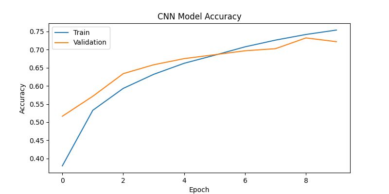
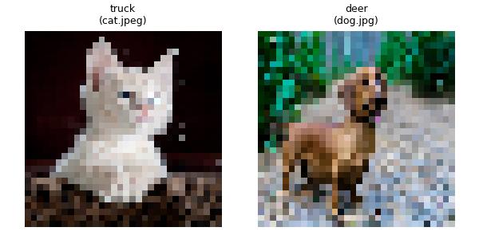

# 🧠 CNN Image Classification using TensorFlow (CIFAR-10 + Custom Images)

### 👩‍💻 Author: Yukta
### 📅 Date: October 2025  

---

## 📌 Problem Statement
This project implements a **Convolutional Neural Network (CNN)** to perform image classification.  
The model is trained on the **CIFAR-10 dataset**, which contains 60,000 color images in 10 categories.  
Additionally, the trained model is used to classify **custom images** provided in the `my_images/` folder.

---

## 🗂️ Dataset
**CIFAR-10 Dataset:**
- 50,000 training images  
- 10,000 testing images  
- Image size: 32x32 pixels  
- Classes:  
  - airplane  
  - automobile  
  - bird  
  - cat  
  - deer  
  - dog  
  - frog  
  - horse  
  - ship  
  - truck  

---

## ⚙️ Model Architecture
| Layer | Type | Filters/Units | Activation | Other |
|-------|------|----------------|-------------|--------|
| 1 | Conv2D | 32 filters, 3x3 | ReLU | Input: 32x32x3 |
| 2 | MaxPooling2D | - | - | 2x2 pool |
| 3 | Conv2D | 64 filters, 3x3 | ReLU |  |
| 4 | MaxPooling2D | - | - | 2x2 pool |
| 5 | Conv2D | 128 filters, 3x3 | ReLU |  |
| 6 | MaxPooling2D | - | - | 2x2 pool |
| 7 | Flatten | - | - |  |
| 8 | Dense | 128 | ReLU | Dropout(0.5) |
| 9 | Dense | 10 | Softmax | Output Layer |

---

## 🧩 Implementation Steps
1. **Preprocessing:**  
   - Normalize pixel values to range [0,1]  
   - Flatten labels  

2. **Model Compilation:**  
   - Optimizer: `Adam`  
   - Loss: `Sparse Categorical Crossentropy`  
   - Metrics: `Accuracy`  

3. **Training:**  
   - Epochs: 10  
   - Batch size: 64  
   - Validation on CIFAR-10 test set  

4. **Evaluation:**  
   - Displays test accuracy  
   - Saves training accuracy graph  

5. **Custom Image Prediction:**  
   - Loads images from `my_images/` folder  
   - Resizes to 32x32  
   - Predicts class labels  
   - Saves collage in `results/my_predictions.png`

---

## 🧠 Results
| Metric | Value |
|---------|--------|
| **Training Accuracy** | ~80% (approx.) |
| **Validation Accuracy** | ~70–75% |
| **Test Accuracy** | ~72% |

---

## 📊 Output Files
| File | Description |
|------|--------------|
| `results/accuracy_plot.png` | Model accuracy per epoch |
| `results/my_predictions.png` | Collage of predictions on custom images |

### Example Output:



---

## ▶️ How to Run

1. **Clone this repository:**
   ```bash
   git clone https://github.com/yuktaapareek/cnn-image-classifier.git
   cd cnn-image-classifier
